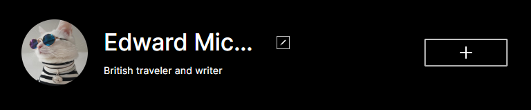
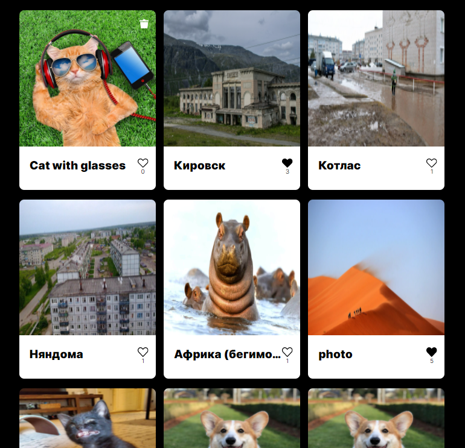

<h1 align="center">Project: mesto-react</h1>

## Project description

This project is a one-page [website](). 
The project includes **the following blocks**:
* block **header** - the page header;  

* block **profile** - personal information about traveler with ability to edit information in the   
profile and to add new elements to the page;  

* block **element** - cards with different places;  

* block **footer** - information about creator.

## What technologies were used?

This project was implemented using technologies which available to a novice developer, such as:
 - [x] OOP;
 - [x] BEM methodology;
 - [x] grid;
 - [x] flex;
 - [x] media queries;
 - [x] pop-up;
 - [x] links;
 - [x] server requests, etc.

## Improvements

**To do next:**  
:soon: set form validation;  
:white_check_mark: add new popup for confirm deleting card;  
:white_check_mark: set animation for request loading moment.  